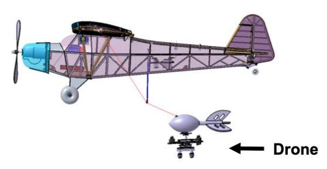

# Multi-Mode-Hybrid-Drone-Delivery-System

The Multi-Mode Hybrid Drone Delivery System (MMHDDS), an existing research project at Rutgers University that leverages a three-component system to give drones the ability to complete long distance deliveries.
The delivery system utilizes a fixed-wing aircraft that has the capacity to carry the drone.
The fixed-wing can fly to a general delivery location and then release the drone to drop off the package at a specific address, minimizing the distance the quadcopter drone must travel. 
After package delivery the drone will redock back through the utilization of computer vision to recognize the docking platform attached to the fixed-wing aircraft.  

This repository focuses on improving the speed at which the computer vision algorithm processes frames and the accuracy to which it calculates the absolute distance and horizontal location of the object of interest to ensure the drone redocks back onto the fixed-wing.




## Table of Contents
- [Features](https://github.com/alexanderdong8/Multi-Mode-Hybrid-Drone-Delivery-System/#features)
- [Technologies](https://github.com/alexanderdong8/Multi-Mode-Hybrid-Drone-Delivery-System/#technologies)
- [Setup](https://github.com/alexanderdong8/Multi-Mode-Hybrid-Drone-Delivery-System/#setup)
- [Authors](https://github.com/alexanderdong8/Multi-Mode-Hybrid-Drone-Delivery-System/#authors)

## Features
- **Range Detector:** used to find the threshold of HSV values for a specified object
- **Frequency Testing:** designed to evaluate how fast each
section of the computer vision algorithm is executed. 
- **Distance Accuracy Test:** quantify how accurately the
drone can determine its distance from the target object
- **Horizontal Position Test:** quantifies the precision of how accurately a drone can determine an object's horizontal position

## Technologies
 - Python 
 - OpenCV 

## Setup
In order to run a local instance of Multi-Mode-Hybrid-Drone-Delivery-System, first clone or download a copy of this repository. To ensure all programs run smoothly, install the required packages using 
`pip install` to install the packages `pymavlink`, `dronekit`, `cv2`, `numpy`, and `simple_pid`

### Range Detector

To run Range Detector, run:

```
py range_detector.py -w -f HSV
```
Use the sliders until the desired object is the only article in view

### Frequency Testing
Utilize the outputted timer to determine when the program is able to detect the desired object

### Distance Accuracy Test
Position an object a certain distance away from the camera and utilize the outputted values to determine the calculated distance of the object.
### Horizontal Position Test
Position an object a horizontal position relative to the camera and utilize the ouputted values to determine the horizontal position of the object.

## Authors
The code for Multi-Mode-Hybrid-Drone-Delivery-System was made created by a previous team working on the project at Rutger's University.  Code utilized in the testing was created by Chirag Khurana, Alexander Dong, Ronald Leung, Chelsy Goodwill, and Kareena Shah.
